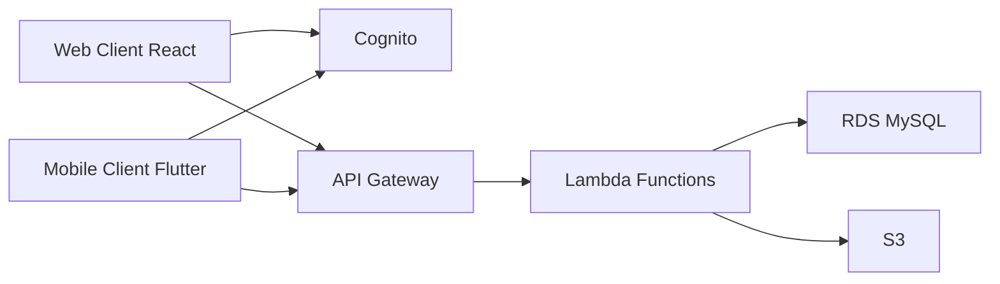

As I began working with cloud services, I encountered various AWS services. As a frontend developer, I believe it's crucial to understand backend infrastructure, so I've compiled this overview of the AWS services we actively use in our service.

## AWS Core Services Overview

### 1. Amazon S3 (Simple Storage Service)

As the leading cloud storage service, we primarily use S3 to store and serve user-uploaded profile pictures and post images.

#### Key Features

- Unlimited object storage capacity
- High durability and availability
- Easy access via URLs
- Image optimization and resizing capabilities

```python
# S3 image upload example
import boto3

s3 = boto3.client('s3')

def upload_profile_image(user_id, image_file):
    file_name = f"profiles/{user_id}/profile.jpg"
    s3.upload_fileobj(
        image_file,
        'my-service-bucket',
        file_name,
        ExtraArgs={'ACL': 'public-read'}
    )
    return f"https://my-service-bucket.s3.amazonaws.com/{file_name}"
```

### 2. AWS Lambda

As the core serverless computing service, all our APIs are implemented using Lambda functions. We use Lambda to handle various functionalities including user authentication, data processing, image uploads, and more.

#### Real-World Use Cases

- User profile update API
- Post CRUD operations
- Automated image resizing
- Notification dispatch

```python
def lambda_handler(event, context):
    # Handle request from API Gateway
    user_id = event['requestContext']['authorizer']['claims']['sub']
    body = json.loads(event['body'])

    try:
        # Profile update logic
        update_user_profile(user_id, body)
        return {
            'statusCode': 200,
            'body': json.dumps({'message': 'Profile updated successfully'})
        }
    except Exception as e:
        return {
            'statusCode': 500,
            'body': json.dumps({'error': str(e)})
        }
```

### 3. Amazon RDS (Relational Database Service)

Our service uses MySQL-based RDS for storing and managing user information, posts, comments, and other data.

#### Database Configuration

- Production environment: MySQL 8.0
- Read replica configuration for performance optimization
- Automated backups and snapshot settings

```python
import pymysql

def get_db_connection():
    return pymysql.connect(
        host='my-service-db.cluster-xxxxxx.region.rds.amazonaws.com',
        user=os.environ['DB_USER'],
        password=os.environ['DB_PASSWORD'],
        database='my_service_db',
        cursorclass=pymysql.cursors.DictCursor
    )

def get_user_profile(user_id):
    with get_db_connection() as conn:
        with conn.cursor() as cursor:
            cursor.execute(
                "SELECT * FROM users WHERE id = %s",
                (user_id,)
            )
            return cursor.fetchone()
```

### 4. Amazon Cognito

We use Cognito for user authentication and authorization management, supporting both social login (Google, Apple) and email-based registration.

#### Key Features

- User pool management
- JWT token-based authentication
- Social login integration
- User attribute management

```javascript
// Cognito usage in frontend
import { Auth } from 'aws-amplify';

async function signIn(email, password) {
    try {
        const user = await Auth.signIn(email, password);
        // Handle successful login
        return user;
    } catch (error) {
        console.error('Login failed:', error);
        throw error;
    }
}

// Cognito token verification in Lambda
def verify_cognito_token(token):
    try:
        decoded = jwt.decode(token, verify=False)
        # Token verification logic
        return decoded['sub']  # Return user ID
    except Exception as e:
        raise Exception('Invalid token')
```

## Service Architecture

Our service architecture is structured as follows:



1. **Clients**

   - React-based web application
   - Flutter-based web/mobile application
   - Cognito integration via Amplify library
   - Direct S3 uploads via AWS SDK

2. **Authentication Flow**

   - Unified user authentication through Cognito
   - Social login support (Google, Apple)
   - JWT token-based API access control

3. **API Processing**
   - Request routing through API Gateway
   - Business logic handling in Lambda functions
   - Data storage/retrieval in RDS
   - Media file management in S3

## Real-World Implementation Examples

### 1. User Profile Image Upload

```javascript
// Image upload in React client
const uploadProfileImage = async (file) => {
  const fileName = `profiles/${userId}/${Date.now()}.jpg`;

  // Direct upload to S3
  await Storage.put(fileName, file, {
    contentType: "image/jpeg",
    level: "public",
  });

  // Profile update via Lambda API
  await API.put("userApi", "/profile", {
    body: {
      profileImage: fileName,
    },
  });
};
```

### 2. Data Synchronization

```dart
// Data sync in Flutter client
Future<void> syncUserData() async {
  try {
    final cognitoToken = await Amplify.Auth.getTokens();
    final response = await http.get(
      Uri.parse('$apiEndpoint/user/sync'),
      headers: {
        'Authorization': cognitoToken.accessToken.toJson()
      },
    );

    if (response.statusCode == 200) {
      // Update local storage
      await updateLocalStorage(json.decode(response.body));
    }
  } catch (e) {
    print('Sync failed: $e');
  }
}
```

## Conclusion

Through implementing AWS services in our project, I've gained a deep understanding of each service's characteristics and trade-offs. As a frontend developer, understanding the backend infrastructure has been invaluable in effectively utilizing the entire system.

The serverless architecture has allowed us to focus on development without the burden of infrastructure management. The combination of Lambda functions and API Gateway enabled rapid API implementation, while Cognito provided secure user authentication. Additionally, S3 and RDS have proven effective for managing data and files.

While supporting both React and Flutter client platforms, AWS services' consistent interfaces have allowed us to maintain a unified backend system. We plan to continue learning and implementing new AWS features to enhance our service's reliability and scalability.

## References

- [AWS Official Documentation](https://docs.aws.amazon.com/)
- [AWS Amplify Documentation](https://docs.amplify.aws/)
- [Flutter AWS Guide](https://docs.flutter.dev/deployment/cd)
- [React AWS Integration Guide](https://aws.amazon.com/getting-started/hands-on/build-react-app-amplify-graphql/)
