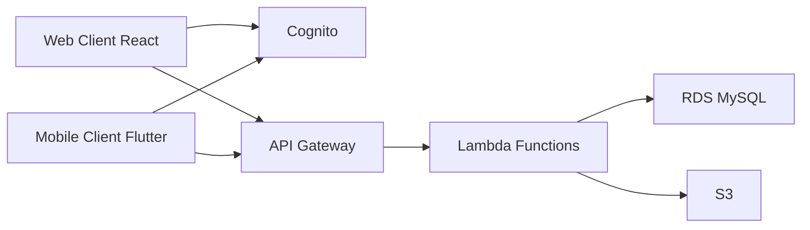

클라우드 서비스를 처음 접하면서 AWS의 다양한 서비스들을 접하게 되었다. 특히 프론트엔드 개발자로서 백엔드 인프라를 이해하는 것이 중요하다고 생각하여, 우리 서비스에서 실제로 사용 중인 AWS 서비스들을 중심으로 정리해보았다.

## AWS 핵심 서비스 개요

### 1. Amazon S3 (Simple Storage Service)

클라우드 스토리지의 대표 서비스로, 우리 서비스에서는 주로 사용자가 업로드한 프로필 사진이나 게시물의 이미지를 저장하고 서비스하는 용도로 사용하고 있다.

#### 주요 특징

- 무제한 용량의 객체 스토리지
- 높은 내구성과 가용성
- URL을 통한 쉬운 접근
- 이미지 최적화 및 리사이징 가능

```python
# S3 이미지 업로드 예시
import boto3

s3 = boto3.client('s3')

def upload_profile_image(user_id, image_file):
    file_name = f"profiles/{user_id}/profile.jpg"
    s3.upload_fileobj(
        image_file,
        'my-service-bucket',
        file_name,
        ExtraArgs={'ACL': 'public-read'}
    )
    return f"https://my-service-bucket.s3.amazonaws.com/{file_name}"
```

### 2. AWS Lambda

서버리스 컴퓨팅의 핵심 서비스로, 우리 서비스의 모든 API는 Lambda 함수로 구현되어 있다. 사용자 인증, 데이터 처리, 이미지 업로드 등 다양한 기능을 Lambda를 통해 처리하고 있다.

#### 실제 사용 사례

- 사용자 프로필 업데이트 API
- 게시물 CRUD 작업
- 이미지 리사이징 자동화
- 알림 발송 처리

```python
def lambda_handler(event, context):
    # API Gateway에서 전달된 요청 처리
    user_id = event['requestContext']['authorizer']['claims']['sub']
    body = json.loads(event['body'])

    try:
        # 프로필 업데이트 로직
        update_user_profile(user_id, body)
        return {
            'statusCode': 200,
            'body': json.dumps({'message': 'Profile updated successfully'})
        }
    except Exception as e:
        return {
            'statusCode': 500,
            'body': json.dumps({'error': str(e)})
        }
```

### 3. Amazon RDS (Relational Database Service)

우리 서비스는 MySQL을 기반으로 한 RDS를 사용하고 있다. 사용자 정보, 게시물, 댓글 등의 데이터를 저장하고 관리하는데 활용하고 있다.

#### 데이터베이스 구성

- 운영 환경: MySQL 8.0
- 읽기 전용 복제본 구성으로 성능 최적화
- 자동 백업 및 스냅샷 설정

```python
import pymysql

def get_db_connection():
    return pymysql.connect(
        host='my-service-db.cluster-xxxxxx.region.rds.amazonaws.com',
        user=os.environ['DB_USER'],
        password=os.environ['DB_PASSWORD'],
        database='my_service_db',
        cursorclass=pymysql.cursors.DictCursor
    )

def get_user_profile(user_id):
    with get_db_connection() as conn:
        with conn.cursor() as cursor:
            cursor.execute(
                "SELECT * FROM users WHERE id = %s",
                (user_id,)
            )
            return cursor.fetchone()
```

### 4. Amazon Cognito

사용자 인증 및 권한 관리를 위해 Cognito를 사용하고 있다. 소셜 로그인(Google, Apple)과 이메일 인증을 통한 회원가입을 지원한다.

#### 주요 기능

- 사용자 풀을 통한 회원 관리
- JWT 토큰 기반 인증
- 소셜 로그인 통합
- 사용자 속성 관리

```javascript
// 프론트엔드에서 Cognito 사용 예시
import { Auth } from 'aws-amplify';

async function signIn(email, password) {
    try {
        const user = await Auth.signIn(email, password);
        // 로그인 성공 처리
        return user;
    } catch (error) {
        console.error('로그인 실패:', error);
        throw error;
    }
}

// Lambda 함수에서 Cognito 토큰 검증
def verify_cognito_token(token):
    try:
        decoded = jwt.decode(token, verify=False)
        # 토큰 검증 로직
        return decoded['sub']  # 사용자 ID 반환
    except Exception as e:
        raise Exception('Invalid token')
```

## 서비스 아키텍처

우리 서비스의 전체 아키텍처는 다음과 같이 구성되어 있다:



1. **클라이언트**

   - React 기반 웹 애플리케이션
   - Flutter 기반 웹/모바일 애플리케이션
   - Amplify 라이브러리로 Cognito 연동
   - AWS SDK를 통한 S3 직접 업로드

2. **인증 흐름**

   - Cognito를 통한 통합 사용자 인증
   - 소셜 로그인(Google, Apple) 지원
   - JWT 토큰 기반 API 접근 제어

3. **API 처리**
   - API Gateway를 통한 요청 라우팅
   - Lambda 함수에서 비즈니스 로직 처리
   - RDS에서 데이터 저장/조회
   - S3에서 미디어 파일 관리

## 실제 사용 사례

### 1. 사용자 프로필 이미지 업로드

```javascript
// React 클라이언트에서의 이미지 업로드
const uploadProfileImage = async (file) => {
  const fileName = `profiles/${userId}/${Date.now()}.jpg`;

  // S3에 직접 업로드
  await Storage.put(fileName, file, {
    contentType: "image/jpeg",
    level: "public",
  });

  // Lambda API를 통해 프로필 업데이트
  await API.put("userApi", "/profile", {
    body: {
      profileImage: fileName,
    },
  });
};
```

### 2. 데이터 동기화 처리

```dart
// Flutter 클라이언트에서의 데이터 동기화
Future<void> syncUserData() async {
  try {
    final cognitoToken = await Amplify.Auth.getTokens();
    final response = await http.get(
      Uri.parse('$apiEndpoint/user/sync'),
      headers: {
        'Authorization': cognitoToken.accessToken.toJson()
      },
    );

    if (response.statusCode == 200) {
      // 로컬 데이터 업데이트
      await updateLocalStorage(json.decode(response.body));
    }
  } catch (e) {
    print('동기화 실패: $e');
  }
}
```

## 마무리

AWS 서비스들을 실제 프로젝트에 적용하면서 각 서비스의 특성과 장단점을 깊이 이해하는 중이다. 특히 프론트엔드 개발자의 관점에서 백엔드 인프라를 이해하는 것이 전체 시스템을 효율적으로 활용하는 데 큰 도움이 되었다. 풀스택을 하고 싶은게 내가 원하는거니까...

## 참고 자료

- [AWS 공식 문서](https://docs.aws.amazon.com/)
- [AWS Amplify 문서](https://docs.amplify.aws/)
- [Flutter AWS 가이드](https://docs.flutter.dev/deployment/cd)
- [React AWS 통합 가이드](https://aws.amazon.com/getting-started/hands-on/build-react-app-amplify-graphql/)
